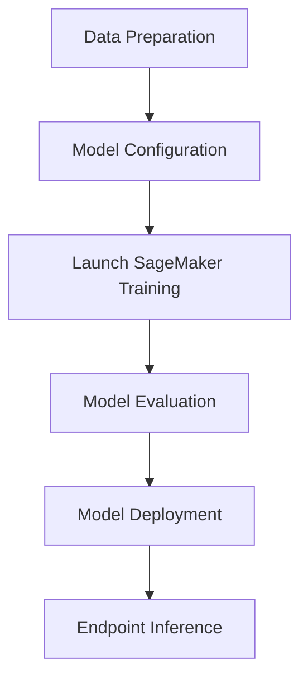

# LLM_PEFT_QLORA_SageMaker

## Introduction

LLM_PEFT_QLORA_SageMaker is a comprehensive repository designed to facilitate the fine-tuning of Large Language Models (LLMs) using Parameter Efficient Fine-Tuning (PEFT) techniques and QLoRA on AWS SageMaker. This solution provides a robust pipeline for data preparation, model configuration, training, evaluation, and deployment, specifically optimized for scalable and cost-effective workflows in the cloud.

## Features

- End-to-end pipeline for QLoRA and PEFT-based LLM fine-tuning
- Seamless AWS SageMaker integration for distributed and managed training
- Data preprocessing scripts for supported text datasets
- Support for multiple model architectures and configurations
- Experiment tracking and model evaluation utilities
- Deployment scripts for launching and monitoring endpoints on SageMaker

## Requirements

- Python 3.8 or later
- AWS CLI configured with proper credentials
- SageMaker Python SDK
- torch, transformers, datasets, and accelerate libraries
- Additional dependencies defined in `requirements.txt`
- An AWS account with permissions to create SageMaker resources

## Installation

1. Clone the repository:
   ```bash
   git clone https://github.com/SameaSaeed/LLM_PEFT_QLORA_SageMaker.git
   cd LLM_PEFT_QLORA_SageMaker
   ```

2. Install Python dependencies:
   ```bash
   pip install -r requirements.txt
   ```

3. Configure AWS credentials:
   - Ensure your AWS CLI is configured by running:
     ```bash
     aws configure
     ```
   - Set up IAM roles with SageMaker access if needed.

## Usage

### 1. Prepare Your Dataset

- Place your training and evaluation datasets in the `data/` directory.
- Use the provided scripts in the `preprocessing/` folder to clean and tokenize your data.

### 2. Configure Training Parameters

- Edit the configuration files in the `config/` directory to set your model, data paths, hyperparameters, and SageMaker settings.
- Choose options for PEFT and QLoRA in the configuration.

### 3. Launch Training on SageMaker

- Use the provided training script to start a SageMaker job:
  ```bash
  python launch_sagemaker_job.py --config config/your_config.yaml
  ```
- Monitor logs and training progress in the SageMaker console.

### 4. Evaluate the Fine-Tuned Model

- After training, use the evaluation utilities in the `evaluation/` directory:
  ```bash
  python evaluation/evaluate_model.py --model-path output/model.tar.gz --dataset data/validation.jsonl
  ```

### 5. Deploy the Model

- Deploy your trained model to a SageMaker endpoint:
  ```bash
  python deployment/deploy_model.py --model-path output/model.tar.gz
  ```
- Invoke the endpoint for real-time predictions using the provided client script.

### 6. Clean Up AWS Resources

- After experimentation, stop endpoints and delete models to avoid unnecessary costs.

---

## System Workflow Overview



---

## Support

For issues or questions, please open an issue in the repository or contact the maintainer via GitHub.

---

## License

This repository is licensed under the MIT License. See the LICENSE file for details.